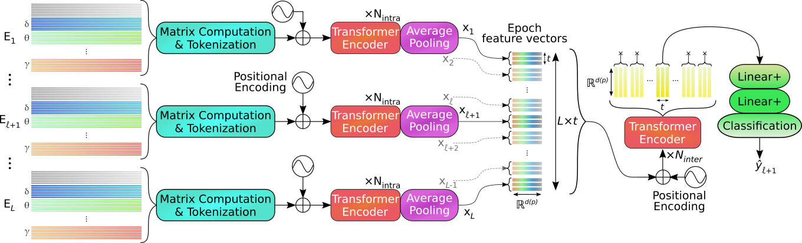

<h1 style="text-align: center; margin-bottom: 0">Sleep Stage Classification using SPD Matrices</h1>
<h2 style="text-align: center; margin-top: 0">through the Transformer-based, structure-preserving SPDTransNet model</h2>

This repository is the official implementation of the SPDTransNet model, as presented in the paper
***Automatic Classification of Sleep Stages from EEG Signals Using Riemannian Metrics and Transformer Networks***
by [Mathieu Seraphim](https://orcid.org/0000-0002-9367-1190), [Alexis Lechervy](https://orcid.org/0000-0002-9441-0187),
[Florian Yger](https://orcid.org/0000-0002-7182-8062), [Luc Brun](https://orcid.org/0000-0002-1658-0527)
and [Olivier Etard](https://orcid.org/0000-0003-3661-0233) - official publication [here](https://doi.org/10.1007/s42979-024-03310-5), full text available [here](https://rdcu.be/dWNI2).

It is a follow-up to our paper ***Structure-Preserving Transformers for Sequences of SPD Matrices*** (Conference EUSIPCO 2024, France - available on [arXiv](https://arxiv.org/pdf/2309.07579.pdf)), in which we first presented our **[SPDTransNet](https://github.com/MathieuSeraphim/SPDTransNet)** model.

**Important:** the implementation found in this repository builds upon the code found in
[the first SPDTransNet repository](https://github.com/MathieuSeraphim/SPDTransNet).
To avoid duplication, this repository only contains instructions relative to innovations introduced in the new paper.
To run the SPDTransNet baseline, please follow the instructions found in said first repository.

For additional information or requests, feel free to [contact us](mailto:mathieu.seraphim@unicaen.fr).

<h2 style="text-align: center;">Additional information</h2>

This repository includes detailed information that was impractical to include in the paper itself:
- Detailed results corresponding to all tables in the paper are available [here](./_z_miscellaneous/documentation/result_tables)
- Heatmaps of mean enriched matrices (cf. Figure 2), for all recordings and channels, can be found [here](./_z_miscellaneous/documentation/mean_enriched_matrices)
  - Generated by the `get_post_enhancement_means.py` [file](./_z_miscellaneous/standalone_tests/get_post_enhancement_means.py)
- The modified ResNet50 receptive fields (Section 2 of Supplementary Material) are described [here](./_z_miscellaneous/documentation/extras/IITNet%20modified%20Resnet50%20receptive%20fields.xlsx)
  - Generated by the `IITNet_receptive_field_finder.py` [file](./_z_miscellaneous/standalone_tests/IITNet_receptive_field_finder.py)

Note that for the purpose of hyperparameter researches, we selected the fold of index 11 for MASS SS3, index 8 for
MASS SS1 and index 19 for Dreem DOD-H (with indexation starting at 0).

<h2 style="text-align: center;">Reproducing our new results</h2>

As stated above, these instructions require that installation instructions found in
[the first SPDTransNet repository](https://github.com/MathieuSeraphim/SPDTransNet)
be followed first.

In this repository (as in the aforementioned first one), it is assumed that all code will be run through Slurm scripts
called by Bash scripts. To run everything from a terminal, simply copy the command lines within said Slurm scripts into
a terminal (removing `srun` and `-u`, and replacing `${SLURM_ARRAY_TASK_ID}` and `$fold` with the
appropriate integers).

**Important:** If you want to run this program in with learned augmentation features, run
[the the appropriate Bash / Slurm script](./_6_bash_scripts/_6_3_slurm_execution/slurm_from_bash_run_preprocessing_MASS_SS3_for_learned_augmentation.sh),
or the corresponding command line (see [here](./_6_bash_scripts/_6_3_slurm_execution/slurm_scripts/slurm_run_preprocessing_MASS_SS3_for_learned_augmentation.sl)).
If needed, an example of Bash script for local execution [is also available](./_6_bash_scripts/_6_2_local_execution/bash_one_run_full_spd_best_mf1_length_21.sh).

<h3 style="text-align: center;">Preprocessing new datasets</h3>

For MASS SS1:
1. As with MASS SS3, create a folder within the `_2_1_original_datasets` [directory](./_2_data_preprocessing/_2_1_original_datasets)
called `MASS_SS1`, and fill it with all 53 pairs of `* Base.edf` and `* PSG.edf` files 
corresponding to all subjects in the dataset.
2. Run [the appropriate extraction script](./_6_bash_scripts/_6_3_slurm_execution/slurm_from_bash_run_extraction_MASS_SS1.sh)
3. Run one of the following preprocessing scripts:
   1. If only utilizing handcrafted augmentation features: [this one](./_6_bash_scripts/_6_3_slurm_execution/slurm_from_bash_run_preprocessing_MASS_SS1.sh)
   2. If utilizing learned augmentation features (e.g. for reproducing our FT or DT results): [this one](./_6_bash_scripts/_6_3_slurm_execution/slurm_from_bash_run_preprocessing_MASS_SS1_for_learned_augmentation.sh)

For Dreem DOD-H:
1. Directly run the `download_Dreem_DOD_H.py` [Python script](./_2_data_preprocessing/_2_1_original_datasets/_download_scripts/download_Dreem_DOD_H.py)
2. Run [the appropriate extraction script](./_6_bash_scripts/_6_3_slurm_execution/slurm_from_bash_run_extraction_Dreem.sh)
3. Run the [corresponding preprocessing script](./_6_bash_scripts/_6_3_slurm_execution/slurm_from_bash_run_preprocessing_Dreem.sh)

<h3 style="text-align: center;">Reproducing our results (LFS)</h3>

The instructions are identical to those in [the first SPDTransNet repository](https://github.com/MathieuSeraphim/SPDTransNet?tab=readme-ov-file#reproducing_results),
with the following caveats:

1. Included in this repository are the Slurm scrip to run our baseline SPDTransNet model on all MASS SS3 folds
([here](./_6_bash_scripts/_6_3_slurm_execution/slurm_scripts/slurm_all_folds_full_spd_best_mf1_length_21.sl)), and its
corresponding Bash script ([here](./_6_bash_scripts/_6_3_slurm_execution/slurm_from_bash_all_folds_full_spd_best_mf1_length_21.sh)).
These will have to be copied and modified to run all other configurations.
2. Unlike MASS SS3, which has 31 folds, MASS-SS1 has 26, and Dreem DOD-H has 25. The number of jobs (and therefore folds)
must be updated in the corresponding Slurm script.
3. The hyperparameter files (found [here](./_1_configs/_1_z_miscellaneous/execution/past_runs_hyperparameters)) used
to generate all SPDTransNet results in the paper (with handcrafted augmentation features) are as follows:
   1. Baseline, MASS SS3: `prevectorized_spd_network_length_21_best_mf1_hparams.yaml`
   2. DAW, MASS SS3: `prevectorized_spd_network_whitening_matrices_from_augmented_matrices_hparams.yaml`
   3. WPA, MASS SS3: `prevectorized_spd_network_length_21_whitening_first_hparams.yaml`
   4. Zero-valued augmentation, MASS SS3: `prevectorized_no_augmentation_hparams.yaml`
   5. Global covariance whitening, MASS SS3: `prevectorized_old_whitening_hparams.yaml`
   6. Classic MHA, MASS SS3: `prevectorized_spd_network_length_21_best_mf1_not_SPD_hparams.yaml`
   7. Input length *L* = 13, MASS SS3: `prevectorized_spd_network_length_13_best_mf1_hparams.yaml`
   8. Input length *L* = 29, MASS SS3: `prevectorized_spd_network_length_29_best_mf1_hparams.yaml`
   9. Baseline, MASS SS1: `prevectorized_on_SS1_hparams.yaml`
   10. Baseline, Dreem DOD-H: `prevectorized_spd_network_dreem_fold_19_hparams.yaml`

<h4 style="text-align: center;">Learned augmentation features</h4>

To run with learned augmentation features, one must first pretrain the signal-wise feature learning submodel.
The full process is as follows:
1. Run the [pretraining script](./_6_bash_scripts/_6_3_slurm_execution/slurm_from_bash_all_folds_pretraining_for_learned_augmentation.sh)
2. Rename the generated `lightning_logs` folder (in repository root) to `lightning_logs_IITNet_pretraining`
3. Run the [learned augmentation training script](./_6_bash_scripts/_6_3_slurm_execution/slurm_from_bash_all_folds_learned_augmentation.sh)

Note that runs utilizing learned augmentation features will not generate temporary files in the `tmp_vectorized_data` folder,
but *will* be more memory-intensive. We recommend dividing the batch size by 8.

<h3 style="text-align: center;">Hyperparameter researches</h3>

Similarly to the above section, in this repository is only included the script for
[running hyperparameter researches on the baseline SPDTransNet model](./_6_bash_scripts/_6_3_slurm_execution/slurm_from_bash_hparam_research_full_spd_length_21.sh).
To run it please follow the instructions found in
[the first SPDTransNet repository](https://github.com/MathieuSeraphim/SPDTransNet?tab=readme-ov-file#hparam_research).

To run researches on other configurations, we have included the configuration files for all needed
[DataModule](./_1_configs/_1_4_data_modules) and [Model](./_1_configs/_1_5_models) objects, as well as for
[hyperparameter selection](./_1_configs/_1_z_miscellaneous/execution/hyperparameter_selection).

Remember that a hyperparameter research for SPDTransNet utilizing learned augmentation features must be preceded by one
for its signal-wise feature extraction submodel.

<h2 style="text-align: center;">Acknowledgements</h2>

The first author is supported by the French National Research Agency (ANR) and Region Normandie under grant HAISCoDe.  
This work was granted access to the HPC resources of IDRIS under the allocation 2022-AD010613618 made by GENCI, and
to the computing resources of CRIANN (Normandy, France).
